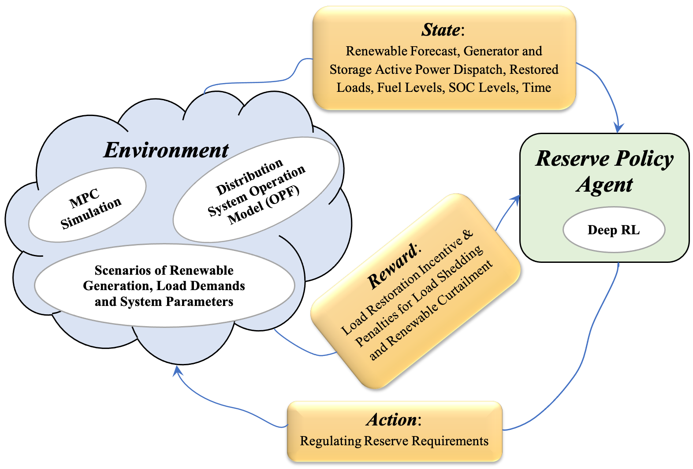
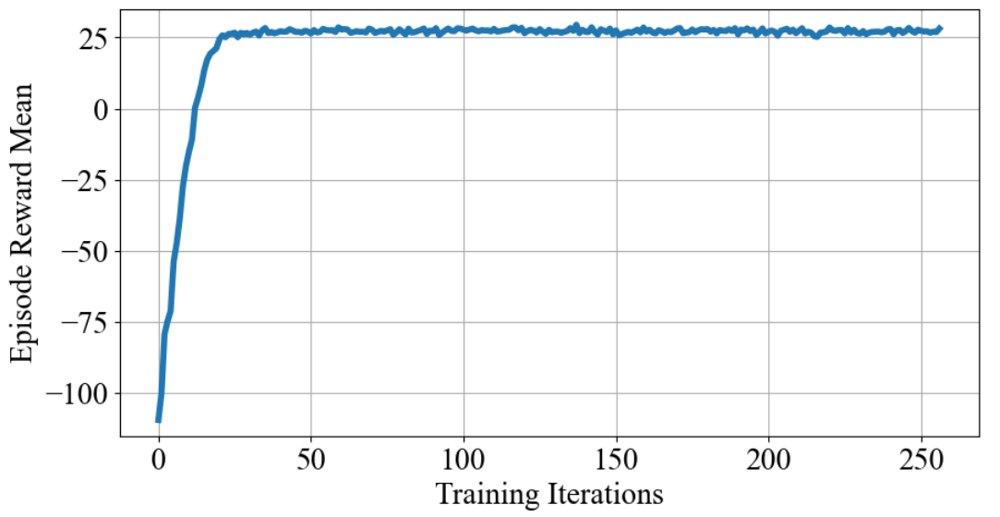
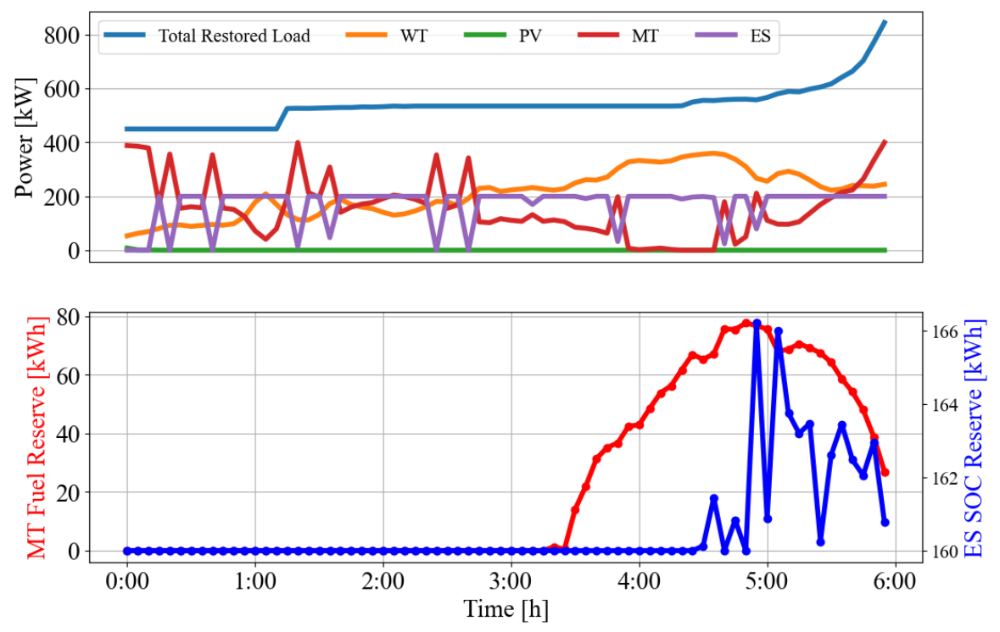

# Hybrid-RL-MPC4CLR Overview

Hybrid-RL-MPC4CLR is a Python-based software package combining deep reinfocement learning and model predictive control (MPC) for critical load restoration (CLR) application in distribution grids. 



Fig. 1. RL-MPC Hybrid Controller Learning Framework.

# Installation

- Hybrid-RL-MPC4CLR is a Python package and therefore requires a Python installation.

- Hybrid-RL-MPC4CLR requires a number of Python packages to be installed in your machine. We recommend first to set up an Anaconda environment, with a Python installation, to install all these packages in one place for this purpose. Run the following command from your terminal (or the Anaconda prompt for Windows users):

    ```
    conda create -n rl-mpc-env python=3.8
    ```
    where 'rl-mpc-env' is the name of the Anaconda environment. You can change this name as you would like. 

- Activate the created Anaconda environment, as follows:

    ```
    conda activate rl-mpc-env
    ```

- Go to the 'gym_mpc_env' folder (i.e., the folder containing setup.py) and run setup.py to install Hybrid-RL-MPC4CLR into your conda environment. Use the command below from your terminal:

    ```
    python setup.py develop
    ```

    You will get a message saying "Finished processing dependencies for rl-mpc-envs==0.0.1" if your installation is successful.

# Requirements

The following packages should also be installed in addition to the packages you have installed with the setup.py file.

- RLlib Ray 

    Hybrid-RL-MPC4CLR uses the RLlib Ray libraries for the RL agent training. Use the following commands to install the relevant RLlib Ray libraries:

    ```
    pip install -U "ray[tune]"  
    pip install -U "ray[rllib]"  
    ```

- Optimization solvers for the OPF/MPC Pyomo model. Hybrid-RL-MPC4CLR is tested with XpressMP and CBC solvers as the developed Pyomo model is mixed-integer linear program (MILP). 

    We recommend Hybrid-RL-MPC4CLR users install the open source CBC MILP solver. CBC installation is platform-specific. Use the following command When using Anaconda on Linux and Mac platforms:

    ```
    conda install -c conda-forge coincbc
    ```

# Testing The Installation

- To test the functionalities of the opf-mpc (load restoration model) part of the Hybrid-RL-MPC4CLR, run the following commands one-by-one from the "...tests/opf_mpc" sub-directory:

    ```
    pytest test_bus.py
    pytest test_branch.py
    pytest test_load.py
    pytest test_DER.py
    pytest test_network_topology.py
    pytest test_load_restoration.py
    ```

- To test the functionalities of the rl-mpc learning environment of the Hybrid-RL-MPC4CLR, run the following command from the "...tests" sub-directory:

    ```    
    pytest test_rl_mpc_env.py
    ```


# Training The RL Agent 

To train the controller (or RL agent) of the Hybrid-RL-MPC4CLR, run the following command from the "...rl_learning" sub-directory:

```
python train_rl_agent.py --num-cpus num_cpu_cores
```

where "num_cpu_cores" is the number of CPU cores for parallel training. Its maximum value is the number of CPU cores in your computing machine minus one. For example, if your machine has 8 CPU cores like the MacBookPro15,2 Processor (Quad-Core Intel Core i7), then you can use values 1 to 7 for "num_cpu_cores". The RL agent training will be faster with higher values of "num_cpu_cores". Note that you also need to specify the training stopping criterion and value in the training script (train_rl_agent.py). The stopping criterion can be the training duration ("time_total_s") or the number of training iterations (training_iteration). An output folder ".../rl_learning/results" will be launched during the training process and the training results will be saved there.

# Testing The Trained Controller 

To test the trained RL agent, execute the following command from the "...rl_learning" sub-directory:

```
python rl_controller_rollout.py
```

This will simulate a trained RL agent saved in the ".../rl_learning/results" sub-directory.


# Examples of Simulation Results

The learning curve of the RL agent is shown below.



Fig. 2. RL Agent Learning Curve. 

The following two figures show the optimal DER dispatch and total load restoartion test outputs of the trained RL-MPC controller for a specific scenario of renewable and load demand profiles and substation power outage begining time.



Fig. 3. RL-MPC controller test results for a specific scenario: DER dispatch and aggregate load restoration. 

# Citing The Project

All publications derived from the use of Hybrid-RL-MPC4CLR should cite the following two papers:

1. Abinet Tesfaye Eseye, Xiangyu Zhang, Bernard Knueven, Matthew Reynolds, Weijia Liu, and Wesley Jones, "A Hybrid Reinforcement Learning-MPC Approach for Distribution System Critical Load Restoration," IEEE PES GM 2022, July 2022. (Accepted). Preprint Link: https://www.nrel.gov/docs/fy22osti/81440.pdf. 

2. Xiangyu Zhang, Abinet Tesfaye Eseye, Matthew Reynolds, Bernard Knueven and Wesley Jones, "Restoring Critical Loads In Resilient Distribution Systems using A Curriculum Learned Controller," IEEE PES GM 2021, July 2021. DOI: https://doi.org/10.1109/PESGM46819.2021.9637834.